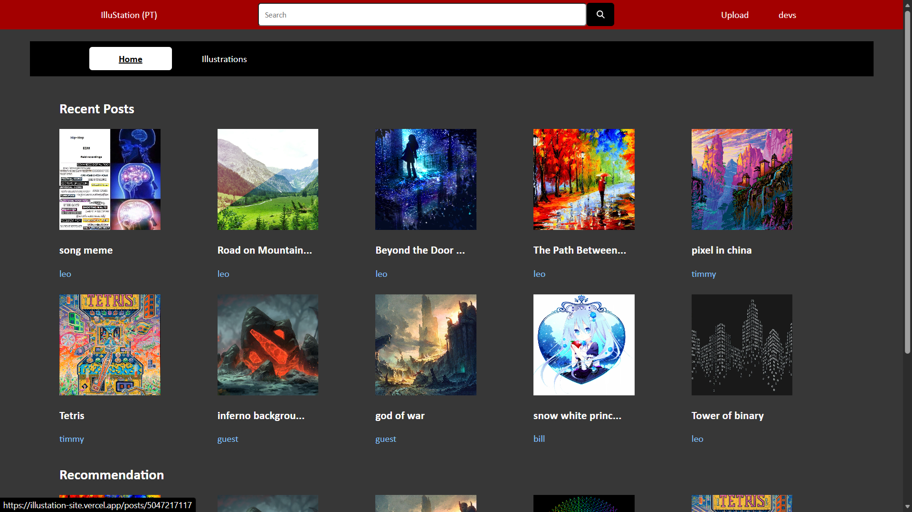
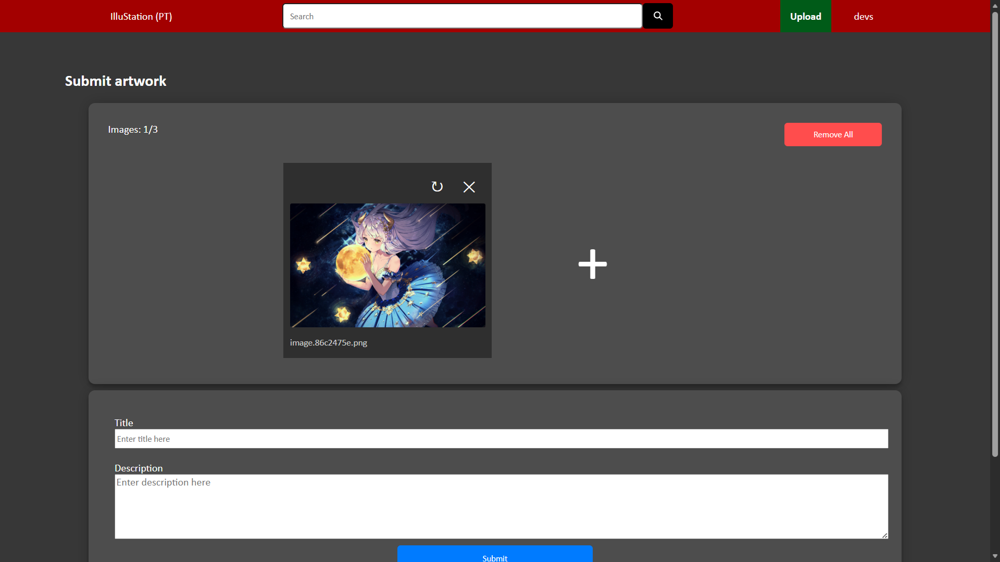
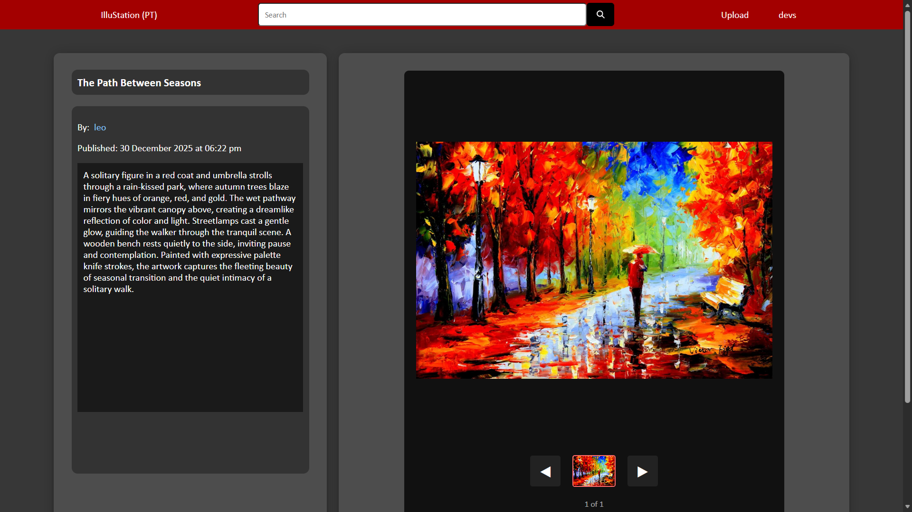

# illustation - Full-stack illustration sharing platform (React, Node, MySQL)

A full-stack web app where users can upload and browse illustrations.
Users can register, login, upload artworks, browse posts, and manage their own content.

## Tech Stack
- React
- Node.js / Express
- MySQL
- Session-based authentication
- Vercel (frontend), Render (backend)

## Features
- User authentication
- Upload artworks
- Manage own posts by browsing, editing and deleting.
- Session-based auth for management
- Pagination & search to view post details

## Live Demo
Frontend: https://illustation-site.vercel.app
Backend: https://illustation-site.onrender.com

## Screenshots

## Run Locally
Frontend: npm start
Backend: node src/server/index.js

